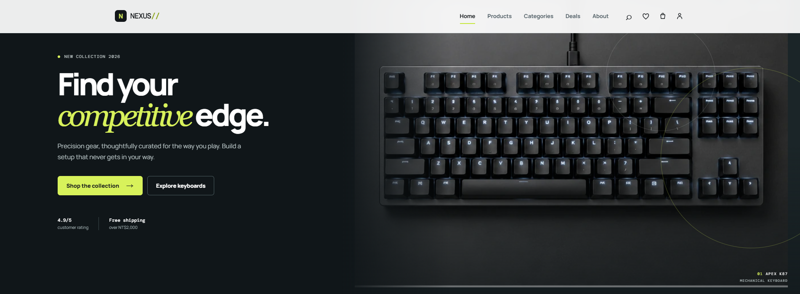
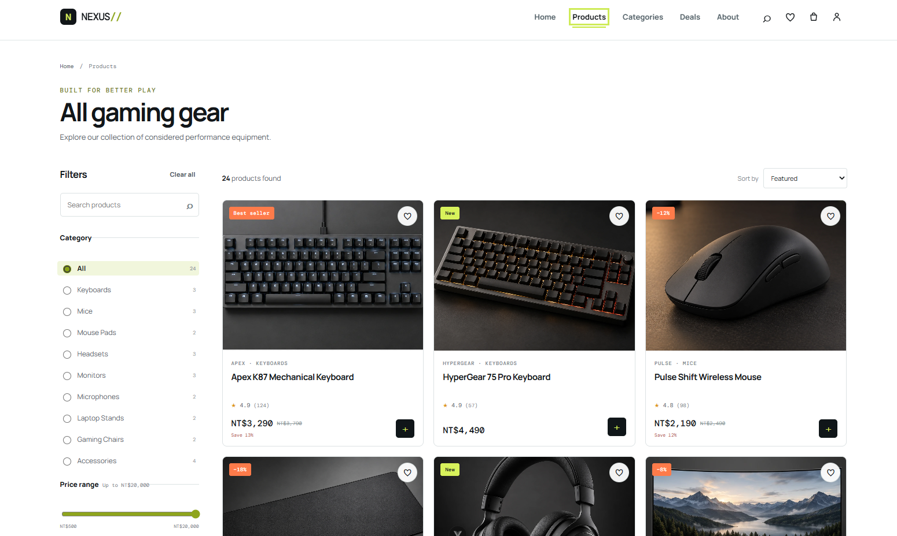
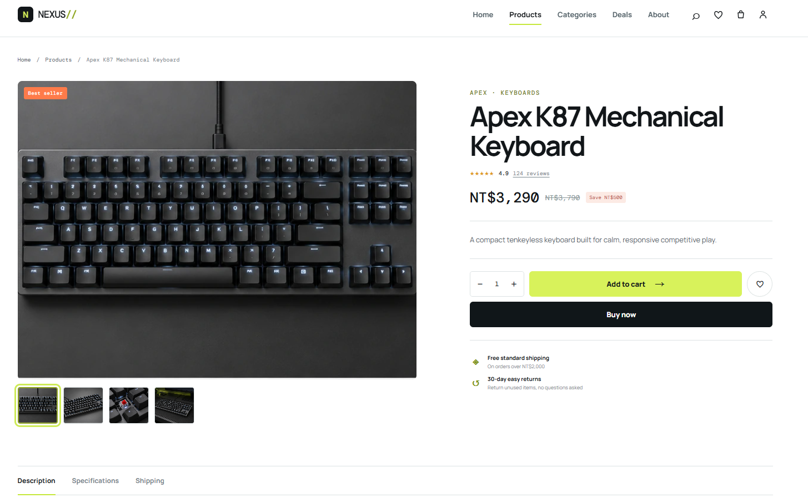
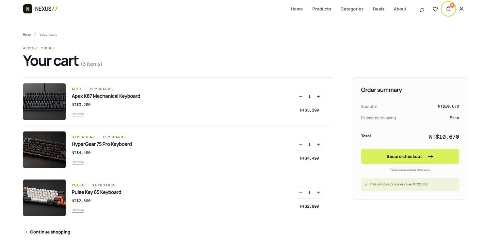

# NEXUS — Gaming E-commerce

NEXUS 是一個以高階 gaming hardware 為主題的前端電商作品集專案。專案聚焦於產品瀏覽、購物流程與一致的互動回饋，將商品目錄、產品詳情、收藏與購物車整合為單頁式體驗。

## 專案介紹

此專案以「專業遊戲周邊選購」為情境，練習將產品資料、篩選邏輯與電商常見互動整合到 Vue 3 介面中。視覺方向採用黑、白與 acid-green 點綴，讓產品照片與資訊層級保持清楚。

## 專案畫面

### 首頁



### 商品列表



### 商品詳情



### 購物車



## 主要功能

- 商品目錄：提供 24 項產品資料與分類瀏覽。
- 搜尋、分類、價格範圍與特價篩選。
- 商品排序：Featured、評分、價格由低至高與由高至低。
- 商品詳情頁：顯示產品說明、規格、數量選擇、相關商品與圖片 gallery。
- Wishlist：可加入／移除收藏，並以 `localStorage` 保存狀態。
- Cart：支援加入商品、數量調整、移除項目、運費與總額計算，並以 `localStorage` 保存狀態。
- Checkout demo：提供收件、運送與付款方式表單；完成後清空購物車並顯示通知。
- Login / Register demo：提供基本表單驗證與前端示範流程，不儲存帳號資料。
- Toast feedback：加入購物車、收藏、下單等操作皆提供即時回饋。
- Responsive design：包含手機版導覽、篩選抽屜與不同螢幕寬度的商品格線調整。

## UI / UX 設計

- 以 gaming hardware e-commerce 為核心，維持乾淨的 editorial 商品展示。
- 黑白基底搭配 acid-green 強調色，保留明確的資訊對比與操作焦點。
- 商品卡統一圖片容器比例；Product Detail 使用較完整的 gallery 體驗。
- 互動元件具備可見的 hover / focus 狀態，並在關鍵動作後提供 toast 通知。

## 技術使用

- [Vue 3](https://vuejs.org/)：Composition API、元件化介面與 reactive state。
- [Vite](https://vite.dev/)：本機開發與 production build。
- JavaScript（ES Modules）。
- CSS：自訂 responsive layout、元件狀態與設計 token。
- Browser `localStorage`：保存購物車與收藏清單。

## 專案結構

```text
src/
├─ assets/          # 全域樣式與靜態資源
├─ components/      # Header、Footer、商品卡、篩選、數量控制、Toast 等可重用元件
├─ composables/     # 購物車與收藏狀態管理
├─ data/            # 產品與分類資料
├─ utils/           # 金額格式化等工具
├─ views/           # 首頁、商品、詳情、購物車、結帳、帳號等頁面
├─ App.vue          # 路由狀態與頁面組裝
└─ main.js          # 應用程式入口

public/
└─ images/          # 產品圖片與 gallery 資產
```

## 安裝與執行

```bash
npm install
npm run dev
```

建立 production build：

```bash
npm run build
```

可使用以下指令預覽 production build：

```bash
npm run preview
```

## 開發重點

- 以資料驅動的產品卡與產品詳情，避免重複建立展示元件。
- 將購物車、收藏與數量調整集中於 `useStore` composable，並同步到 `localStorage`。
- 商品列表篩選與排序使用 computed state，維持 UI 與資料的一致性。
- 將產品主圖與 detail gallery 分開管理，讓 catalogue 與詳情頁各自使用合適的影像層級。
- 使用 History API 處理前端頁面切換與 query parameters，同時維持無框架 router 的輕量實作。

## 後續改善

- 串接後端 API、會員驗證與實際訂單流程。
- 補上單元／元件測試與 E2E 測試。
- 部署 live demo，並加入專案畫面與案例說明。
